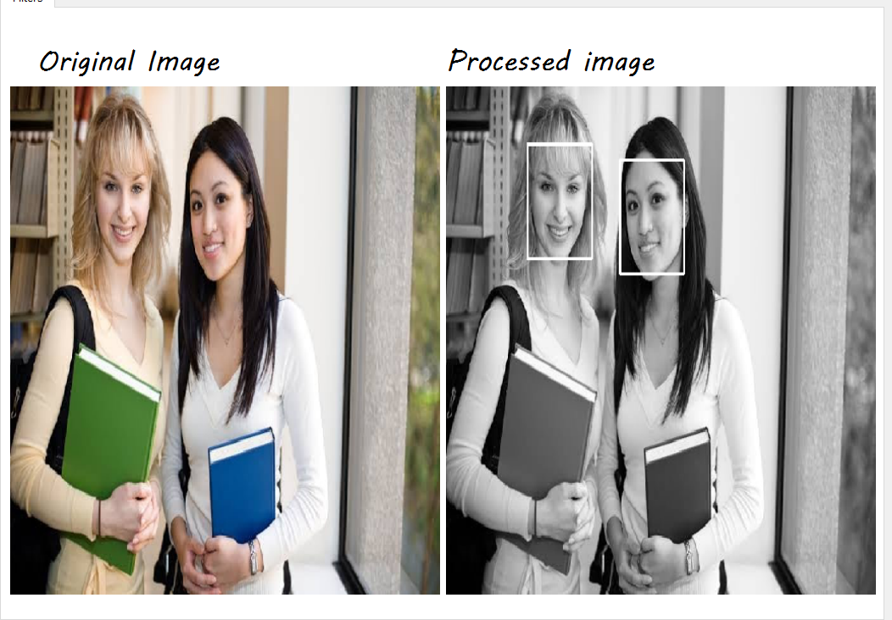
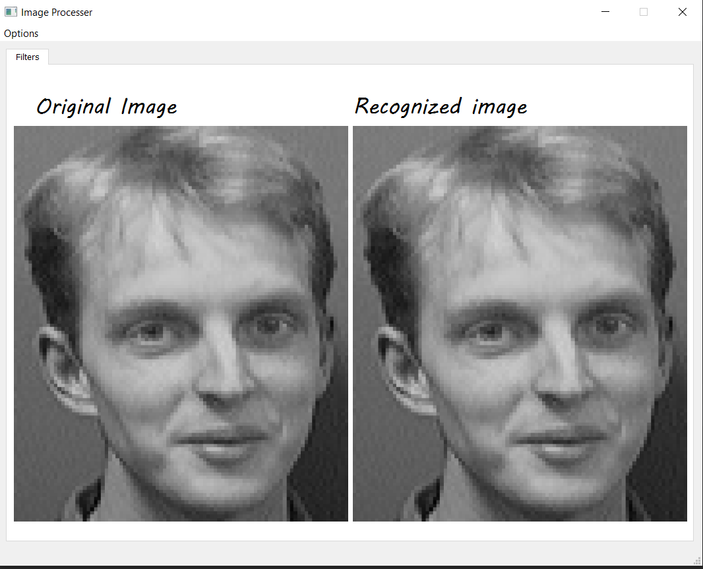
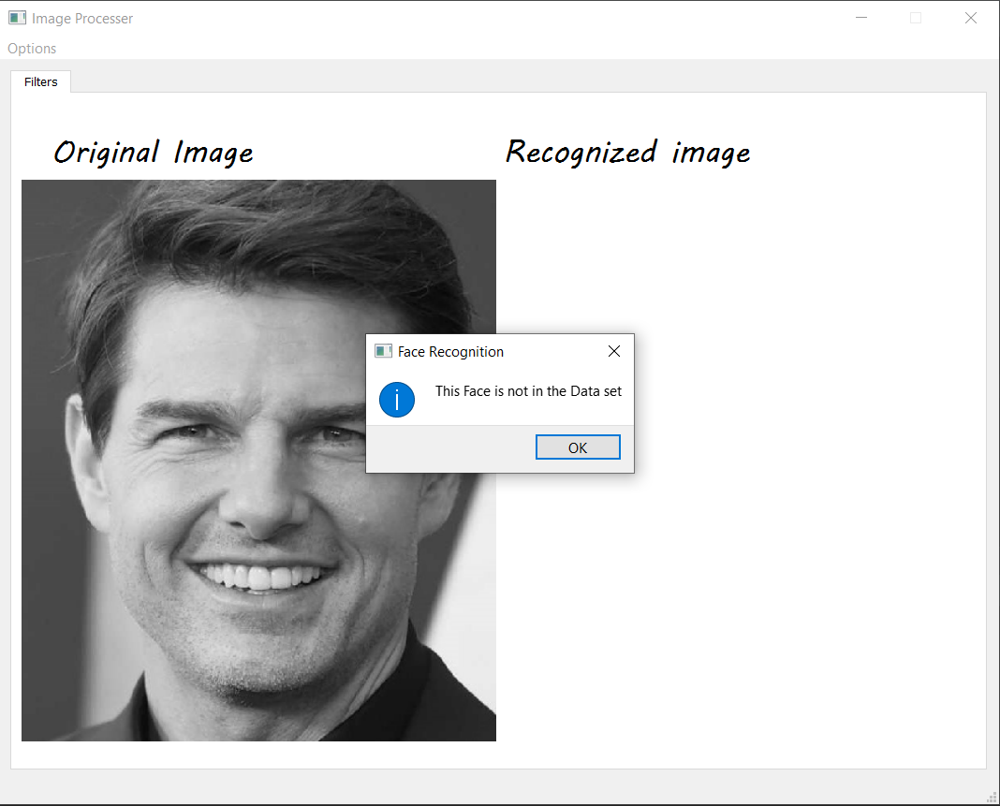

# FaceRecogntionAndDetectionBased-on-PCA-Eigen-analysis
# [1] Face detection 
## Haar cascade Classifier are used to detect faces 

----------------------
# [2] Face recognition 
## PCA Eigen analysis- Eigen faces
### Data set used for training >> https://www.face-rec.org/databases/
#### Recognized face

#### Not Recognized face

----------------------
